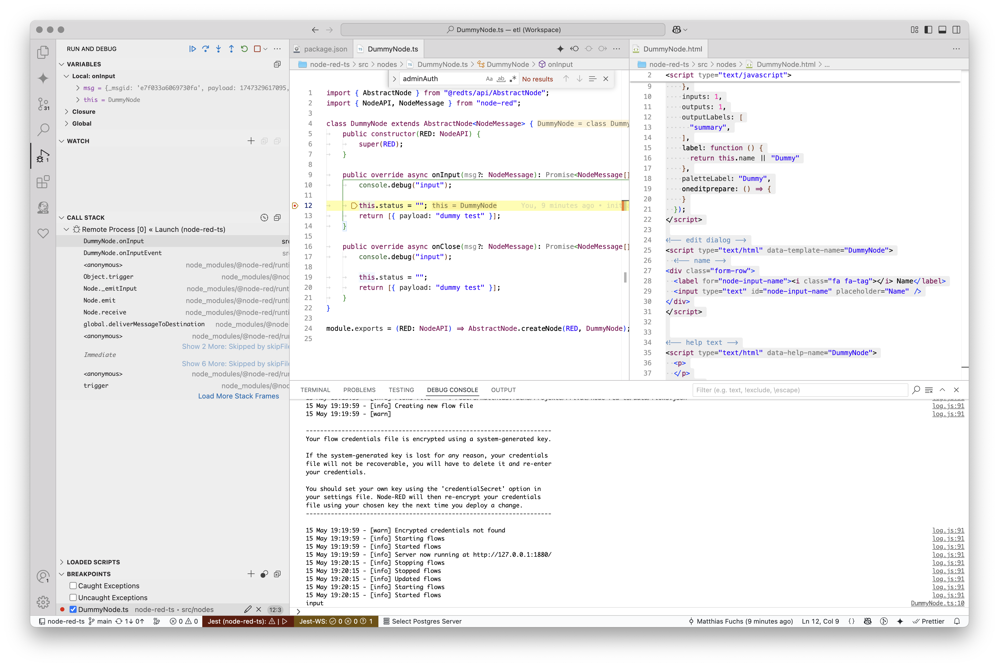

# node-red-ts

This project was born because I hate the overly complex and nested structure of the Node-RED API. I wanted something easy and clean and typescript-based.

This is how a simply node looks like:

```ts
import { AbstractNode } from "@redts/api/AbstractNode";
import { NodeAPI, NodeMessage } from "node-red";

class DummyNode extends AbstractNode<NodeMessage> {
	public constructor(RED: NodeAPI) {
		super(RED);
	}

	public override async onInput(msg?: NodeMessage): Promise<NodeMessage[]> {
		console.debug("input");

		this.status = "";
		return [{ payload: "dummy test" }];
	}

	public override async onClose(msg?: NodeMessage): Promise<NodeMessage[]> {
		console.debug("input");

		this.status = "";
		return [{ payload: "dummy test" }];
	}
}

module.exports = (RED: NodeAPI) => AbstractNode.createNode(RED, DummyNode);
```

The corresponding HTML file looks a little bit more complex though:
```html
<!-- definition  -->
<script type="text/javascript">
  RED.nodes.registerType("DummyNode", {
    category: "HHLA",
    color: "#1eb3fd",
    icon: "font-awesome/fa-cogs",
    defaults: {
      name: { value: "" },
    },
    inputs: 1,
    outputs: 1,
    outputLabels: [
      "summary",
    ],
    label: function () {
      return this.name || "Dummy"
    },
    paletteLabel: "Dummy",
    oneditprepare: () => {
    }
  });
</script>

<!-- edit dialog -->
<script type="text/html" data-template-name="DummyNode">
  <!-- name -->
<div class="form-row">
  <label for="node-input-name"><i class="fa fa-tag"></i> Name</label>
  <input type="text" id="node-input-name" placeholder="Name" />
</div>
</script>


<!-- help text -->
<script type="text/html" data-help-name="DummyNode">
  <p>
  </p>
</script>
```

The HTML structure is based on the Node-RED API. Ideally this would be generated from a type-safe representation, maybe a TS class or another well defined structural language.

The node files are in the "src/nodes" folder of this project.

The project itself is runnable in node-red and fully debuggable in vscode (launch config and all is included).

It looks like this:

